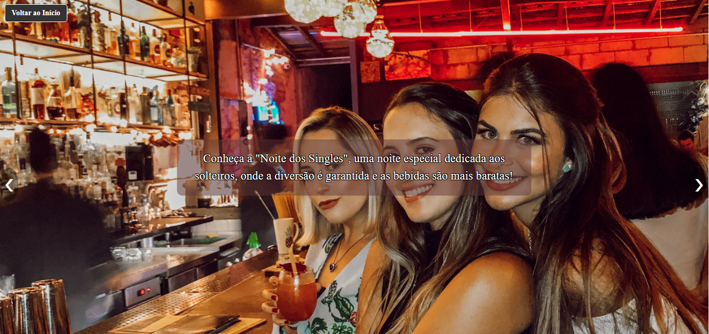
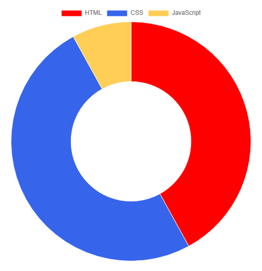

# Singles Bar 🍸🎶

Bem-vindo ao **Singles Bar**, um site para o bar e restaurante fictíco (mas quem sabe um dia) localizado na Costa Azul, Macaé. Este projeto captura a atmosfera acolhedora e sofisticada do **Singles**, oferecendo aos visitantes uma experiência virtual que reflete a elegância e o charme do local.

 

---

## 📸 Capturas de Tela

Aqui estão algumas imagens do projeto para uma visão geral do design e do conteúdo:

### Página Inicial


### Aba Menu


### Eventos


---

## 📊 Tecnologias e Linguagens Utilizadas

Este projeto foi desenvolvido com as seguintes tecnologias:



- **HTML**: 42%
- **CSS**: 50%
- **JavaScript**: 8%

---

## 🌟 Funcionalidades Principais

- **Slideshow de Fotos**: Apresenta imagens do ambiente com transições suaves.
- **Menu Responsivo**: Inclui um menu lateral acessível em dispositivos móveis.
- **Reservas**: Opção para reservar mesas, otimizando a experiência dos clientes.
- **Música e Ambiente**: Informações sobre trilha sonora de blues e noites temáticas, como clássicos dos anos 40 e noite dos Solteiros.
- **Links para Redes Sociais**: Inclui botões para WhatsApp, GitHub e LinkedIn do desenvolvedor, visto que é um bar fictício. Em um bar real, os links seriam do próprio.

---

## 🛠️ Instalação e Uso

Para rodar o projeto localmente, siga estas instruções:

1. **Clone o repositório**:

    ```bash
    git clone https://github.com/seu-usuario/singles-bar.git
    ```

2. **Navegue até a pasta do projeto**:

    ```bash
    cd singles-bar
    ```

3. **Abra o arquivo `index.html`** diretamente em um navegador para visualizar o site e suas páginas.

---

## 🖼️ Estrutura de Pastas

- **index.html**: Página principal.
- **equipe.html**: Página com informações da Equipe.
- **eventos-e-festas.html**: Página do Calendário de Eventos.
- **comida-e-bebida.html**: Página do Cardápio.
- **opinioes.html**: Página com comentário dos clientes.
- **nota-esclarecimento.html**: Nota que abrirá ao clicar no rodapé, informando um site fictício.
- **reservas-e-contato.html**: Página epecífica para reservas.
- **style.css**: Estilos do site. Algumas Páginas tem seu estilo especificado, ou em 
estruturas específicas, ou nos próprios html. 
- **rodape.css**: Estilos específicos para o rodapé.
- **script.js**: Lógica JavaScript para o slideshow e menu.
- **/assets**: Imagens e recursos visuais utilizados no projeto.

---

## 📬 Contato

Se voce se interessou, entre em contato:

- **Whatsapp**: (32) 9 8456-0451
- **Email**: joaobosco2097@hotmail.com
- **GitHub**: [Joaobosco25](https://github.com/joaobosco25)
- **LinkedIn**: [João Bosco Ferreira](https://www.linkedin.com/in/jo%C3%A3o-bosco-ferreira-2a6b46225)

---

## 🌐 Links Importantes

- [Nota de Esclarecimento](./nota-esclarecimento.html)
- [Informações do Projeto](./info-projeto.html)
- [Contato do Desenvolvedor](./pagina.html)

---

## 📝 Licença

Este projeto é distribuído sob a licença MIT. Consulte o arquivo LICENSE para mais informações.

---

© 2024 Singles Bar. Todos os direitos reservados. Desenvolvido por Bosco.Dev
